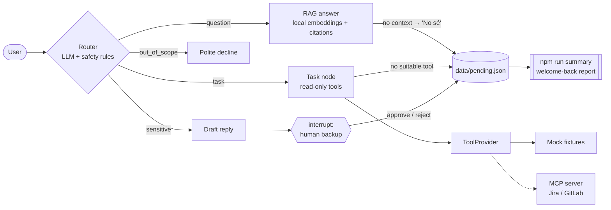

# Suplente digital

A digital backup for routine work: a bot trained on a person's (or team's) knowledge that answers frequent questions and covers small read-only tasks while they are on vacation or leave — and escalates everything else to a human.

This instance is configured as the **Frontend Architecture backup** for a fictional company, *Acme*: Angular Elements web components, shared Angular libraries, a shell app, a CDN version manifest and CI pipelines. Users talk to it in Spanish.

> All knowledge docs and tool fixtures are fictional (`Acme`, `cdn.example.com`, `DEMO-101`). No real data, URLs or credentials are included.

## Architecture

An orchestrator (LangGraph.js) routes each request to RAG, read-only tools (designed to be backed by MCP servers), or human-in-the-loop review.



| Piece | Where | Notes |
|-------|-------|-------|
| Orchestrator | `src/graph/graph.ts` | `StateGraph` + `MemorySaver` checkpointer |
| Router | `src/graph/router.ts` | JSON classification validated with zod + deterministic `detectSensitive` |
| RAG | `src/rag/*`, `src/graph/answer.ts` | Heading-aware chunking, `Xenova/multilingual-e5-small` via `@huggingface/transformers` (no API key), cosine over `data/index.json` |
| Tools | `src/tools/*`, `src/graph/task.ts` | `ToolProvider` interface; mock by default, MCP client when configured |
| Human-in-the-loop | `src/graph/escalate.ts` | LangGraph `interrupt()`; the bot never executes the action |
| Pending log | `src/pending/*` | Append-only JSON + grouped "welcome back" summary |
| Model | `src/llm.ts` | `ChatAnthropic`, model from `ANTHROPIC_MODEL` (default `claude-sonnet-5-5`) |

The full spec lives in [`docs/spec.md`](docs/spec.md).

## Quickstart

Requirements: Node.js ≥ 20 and an Anthropic API key (only needed for chat and evals).

```bash
npm install
cp .env.example .env          # set ANTHROPIC_API_KEY
npm run ingest                # downloads the embedding model once, builds data/index.json
npm run dev                   # interactive chat
```

If your npm version blocks dependency install scripts, approve `onnxruntime-node` (needed by local embeddings): `npm install-scripts approve onnxruntime-node`.

Other scripts:

| Script | What it does |
|--------|--------------|
| `npm run summary` | Welcome-back report from `data/pending.json` |
| `npm run eval` | Runs `evals/questions.json` through the graph and prints route accuracy, fact hit rate and correct "no sé" |
| `npm test` | Unit tests (no network: fake LLM and fake embeddings) |
| `npm run typecheck` | `tsc --noEmit` |

Example session:

```text
vos> ¿Qué reviso si acme-header no carga desde el CDN?
suplente [question]> Primero mirá la consola: un 404 sobre bundle.js indica ... [1]
Fuentes:
[1] troubleshooting-componente-no-carga.md › Troubleshooting: el componente no carga > 1. Revisar la consola del navegador

vos> Mergeá el MR de acme-card a main
[Pedido sensible: requiere aprobación del backup humano]
backup> ¿Aprobar la respuesta propuesta? (s/n)
```

## Adapting it to another person or team

1. **Knowledge**: replace the files in `knowledge/` with that person's docs, runbooks and FAQs (markdown, one topic per heading), then `npm run ingest`.
2. **Prompts**: adjust the persona lines in `src/graph/router.ts` (`ROUTER_PROMPT`) and the other node prompts.
3. **Tools**: implement `ToolProvider` (`src/tools/types.ts`) for your systems, or point `MCP_SERVER_COMMAND` / `MCP_TOOL_*` at an MCP server that exposes equivalent read-only tools.
4. **Safety net**: extend `SENSITIVE_PATTERNS` in `src/graph/router.ts` with the irreversible actions of that domain.
5. **Evals**: rewrite `evals/questions.json` with real questions from that team and tune `retrieval.minScore`.

## Safety notes

- The bot has **no write tools**. Sensitive or irreversible requests produce a draft and pause for a human; even approved drafts are executed by people, not by the bot.
- Requests for secrets, merges, deploys to production, deletions or permission changes are escalated by a deterministic rule, regardless of the model's routing.
- Answers come only from retrieved docs, with citations; otherwise the bot says "No sé" and logs the question.
- `data/` (index and pending log) and `.env` are gitignored.
