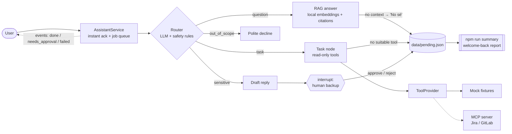

# Suplente digital

A digital backup for routine work: a bot trained on a person's (or team's) knowledge that answers frequent questions and covers small read-only tasks while they are on vacation or leave — and escalates everything else to a human.

This instance is configured as the **Frontend Architecture backup** for a fictional company, *Acme*: Angular Elements web components, shared Angular libraries, a shell app, a CDN version manifest and CI pipelines. Users talk to it in Spanish.

> All knowledge docs and tool fixtures are fictional (`Acme`, `cdn.example.com`, `DEMO-101`). No real data, URLs or credentials are included.

## Architecture

An `AssistantService` acknowledges each request instantly and runs it in a background queue; an orchestrator (LangGraph.js) then routes it to RAG, read-only tools (designed to be backed by MCP servers), or human-in-the-loop review.



| Piece | Where | Notes |
|-------|-------|-------|
| Service | `src/service/*` | `submit()` → instant deterministic ack; in-process queue (`ASSISTANT_CONCURRENCY`, default 1); typed events; `approve` / `reject` / `status` / `list` |
| Orchestrator | `src/graph/graph.ts` | `StateGraph` + `MemorySaver` checkpointer |
| Router | `src/graph/router.ts` | JSON classification validated with zod + deterministic `detectSensitive` |
| RAG | `src/rag/*`, `src/graph/answer.ts` | Heading-aware chunking, `Xenova/multilingual-e5-small` via `@huggingface/transformers` (no API key), cosine over `data/index.json` |
| Tools | `src/tools/*`, `src/graph/task.ts` | `ToolProvider` interface; mock by default, MCP client when configured |
| Human-in-the-loop | `src/graph/escalate.ts` | LangGraph `interrupt()`; the bot never executes the action |
| Pending log | `src/pending/*` | Append-only JSON + grouped "welcome back" summary |
| Model | `src/llm.ts` | `LLM_PROVIDER=openai-compatible` (default: `ChatOpenAI` against a local Ollama / llama.cpp server) or `anthropic` (`ChatAnthropic`); `<think>` blocks are stripped |

The full spec lives in [`docs/spec.md`](docs/spec.md).

## Quickstart

Requirements: Node.js ≥ 20 and an LLM for chat and evals: a local model behind an OpenAI-compatible server (default, no API key) or an Anthropic API key.

```bash
npm install
cp .env.example .env          # pick the LLM (see "Run with a local model")
npm run ingest                # downloads the embedding model once, builds data/index.json
npm run dev                   # interactive chat
```

If your npm version blocks dependency install scripts, approve `onnxruntime-node` (needed by local embeddings): `npm install-scripts approve onnxruntime-node`.

Other scripts:

| Script | What it does |
|--------|--------------|
| `npm run summary` | Welcome-back report from `data/pending.json` |
| `npm run eval` | Runs `evals/questions.json` through the graph and prints route accuracy, fact hit rate, correct "no sé" and injection resisted |
| `npm test` | Unit tests (no network: fake LLM and fake embeddings) |
| `npm run typecheck` | `tsc --noEmit` |

Example session:

```text
vos> ¿Qué reviso si acme-header no carga desde el CDN?
suplente> Recibido 👀 (consulta #1). Lo estoy revisando y te respondo en cuanto lo tenga.
vos> Mergeá el MR de acme-card a main
suplente> Recibido 👀 (consulta #2). Parece un pedido que necesita aprobación del backup humano: preparo un borrador y te aviso. Hay 1 consulta antes que la tuya.

suplente [#1 · question]> Primero mirá la consola: un 404 sobre bundle.js indica ... [1]
Fuentes:
[1] troubleshooting-componente-no-carga.md › Troubleshooting: el componente no carga > 1. Revisar la consola del navegador

[#2] Pedido sensible: requiere aprobación del backup humano. El bot no ejecuta la acción.
Borrador: ...
→ /aprobar 2 [nota]  o  /rechazar 2 [nota]
```

## Instant acknowledgement

A local model takes ~25 s per answer, so nobody waits on a blank screen. `AssistantService.submit(text, { requester })` returns right away with a deterministic acknowledgement (no model call; keyword hints only), then runs the graph in a background queue:

```text
vos> ¿Cómo publico una versión nueva de @acme/ui-kit?
suplente> Recibido 👀 (consulta #3). Lo estoy revisando y te respondo en cuanto lo tenga.
vos> /estado
#3 [procesando] ¿Cómo publico una versión nueva de @acme/ui-kit?

suplente [#3 · question]> Seguí estos pasos: ... [1]
```

The service emits typed events; transports only decide how to deliver them:

| Event | Payload | Typical delivery |
|-------|---------|------------------|
| `done` | `id`, `requester`, `route`, `answer` | Follow-up reply to the requester |
| `needs_approval` | `id`, `requester`, `draft` | Card to the human backup with approve / reject buttons |
| `failed` | `id`, `requester`, friendly `message`, technical `error` | Friendly reply; `error` goes to logs only |

A Teams (or Slack) adapter would plug in like this:

1. On an incoming message, call `submit(text, { requester })`, reply with `ack` in the same turn, and store the conversation reference keyed by the returned `id`.
2. Subscribe to `done` / `failed` and send the result as a **proactive message** to that stored conversation reference.
3. Send `needs_approval` to the backup's channel as an adaptive card; its buttons call `approve(id, note)` / `reject(id, note)`. The bot still never executes the action.

For production, swap the in-process queue and `MemorySaver` for durable ones (see T3 in the task list) so jobs survive restarts.

CLI commands: `/aprobar <n> [nota]`, `/rechazar <n> [nota]`, `/estado`, `/pendientes`, `/ayuda`, `/salir`. Results print tagged with their number and the prompt is redrawn, so you can keep typing while earlier questions run. On `/salir` or end of input the CLI waits for running jobs; jobs still awaiting approval are reported and nothing is executed.

## Run with a local model

The default provider (`LLM_PROVIDER=openai-compatible`) talks to any OpenAI-compatible `/v1` endpoint. `LLM_MODEL` is required; `LLM_API_KEY` is optional (local servers ignore it).

**Ollama** (default `LLM_BASE_URL=http://localhost:11434/v1`):

```bash
ollama pull qwen3:8b
ollama serve                  # if it is not already running
# .env: LLM_MODEL=qwen3:8b
```

**PrismML Bonsai 27B (1-bit)** — recommended temperature 0.5 (the default `LLM_TEMPERATURE`):

- If your Ollama version supports the `Q1_0` quantization type: `ollama pull hf.co/prism-ml/Bonsai-27B-gguf:Q1_0` and set `LLM_MODEL=hf.co/prism-ml/Bonsai-27B-gguf:Q1_0`.
- Otherwise use PrismML's llama.cpp build and run its `llama-server` on port 8080 with the Bonsai GGUF, then set `LLM_BASE_URL=http://localhost:8080/v1` and `LLM_MODEL` to the model name the server reports.

Reasoning models (Qwen3, Bonsai) may emit `<think>…</think>` blocks: they are stripped before routing and answering. `LLM_DISABLE_THINKING=true` (default) also sends `chat_template_kwargs: {enable_thinking: false}`, which llama.cpp honors and other servers ignore. If the server is down, chat and evals fail with a message naming `LLM_BASE_URL` and `ollama serve`.

To use Claude instead: `LLM_PROVIDER=anthropic` plus `ANTHROPIC_API_KEY` (optional `ANTHROPIC_MODEL`).

## Adapting it to another person or team

1. **Knowledge**: replace the files in `knowledge/` with that person's docs, runbooks and FAQs (markdown, one topic per heading), then `npm run ingest`.
2. **Prompts**: adjust the persona lines in `src/graph/router.ts` (`ROUTER_PROMPT`) and the other node prompts.
3. **Tools**: implement `ToolProvider` (`src/tools/types.ts`) for your systems, or point `MCP_SERVER_COMMAND` / `MCP_TOOL_*` at an MCP server that exposes equivalent read-only tools.
4. **Safety net**: extend `SENSITIVE_PATTERNS` in `src/graph/router.ts` with the irreversible actions of that domain.
5. **Evals**: rewrite `evals/questions.json` with real questions from that team and tune `retrieval.minScore`.

## Safety notes

Full threat model (lethal trifecta, OWASP LLM01/02/06, residual risks): [`docs/security.md`](docs/security.md).

- The bot has **no write tools**; the read-only allowlist (`TOOL_POLICIES`) is enforced by every provider, and the MCP provider refuses unlisted or destructive tools.
- Retrieved docs and tool results are wrapped in delimiters and treated as untrusted data; an output guard strips links to non-allowlisted hosts (`ALLOWED_LINK_HOSTS`) and redacts token formats. `knowledge/faq-registry-npm.md` is a deliberate prompt-injection test fixture.
- The bot never executes actions itself. Sensitive or irreversible requests produce a draft and pause for a human; even approved drafts are executed by people, not by the bot.
- Requests to merge, deploy to production, delete or change permissions are escalated by a deterministic rule, regardless of the model's routing; *how-to* questions about those procedures ("¿Cómo despliego a producción?") are answered from the docs instead. Anything about secrets is always escalated.
- Answers come only from retrieved docs, with citations; otherwise the bot says "No sé" and logs the question.
- `data/` (index and pending log) and `.env` are gitignored.
