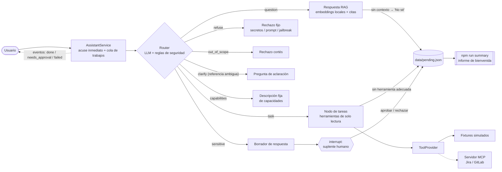

# Suplente digital

[](https://github.com/serranitoFlock/suplente-digital/actions/workflows/ci.yml)

Un suplente digital para el trabajo rutinario: un bot entrenado con el conocimiento de una persona (o de un equipo) que responde preguntas frecuentes y cubre tareas pequeñas de solo lectura mientras esa persona está de vacaciones o de licencia, y deriva todo lo demás a un humano.

Esta instancia está configurada como **suplente de Arquitectura Frontend** de una empresa ficticia, *Acme*: web components con Angular Elements, librerías Angular compartidas, una shell app, un manifiesto de versiones en CDN y pipelines de CI. Los usuarios interactúan con el bot en español.

> Todos los documentos de conocimiento y los fixtures de herramientas son ficticios (`Acme`, `cdn.example.com`, `DEMO-101`). No se incluyen datos, URLs ni credenciales reales.

## Impacto de negocio

**Problema.** El conocimiento del equipo suele concentrarse en una sola persona. Mientras esa persona está de vacaciones o de licencia, sus compañeros interrumpen a quien la cubre con las mismas preguntas rutinarias ("¿cómo publico una librería?", "¿por qué el componente no carga desde el CDN?"), buscan por su cuenta en documentos y tickets, o quedan bloqueados hasta que la persona vuelve. Los pedidos riesgosos (deploy, merge, permisos) no tienen un camino seguro y, al regresar, la persona no sabe qué se le consultó.

**Quiénes se benefician.**

| Quién | Cómo |
|-----|-----|
| Desarrolladores que consumen el trabajo de la persona | Respuestas con fuentes y consultas de solo lectura en segundos o minutos, en lugar de esperar días |
| El suplente humano | Solo recibe lo que realmente necesita a una persona: borradores sensibles para aprobar o rechazar, nunca preguntas rutinarias |
| La persona que regresa | Un resumen de bienvenida (`npm run summary`) agrupado por tema, con las preguntas que los documentos no pudieron responder → una lista concreta de documentos por escribir |

**Cómo ahorra tiempo.** Las preguntas rutinarias se responden a partir de los documentos con citas, las consultas pequeñas (estado de tickets, pipelines fallidos) se resuelven sin usar las credenciales de nadie, y todo lo demás se deriva o se registra en lugar de perderse. Cada pedido recibe un acuse de recibo inmediato, de modo que nadie espera frente a una pantalla vacía.

**Estimación aproximada.** Cada dato de entrada es un **supuesto** con fines ilustrativos, no una medición; reemplazarlos por números propios.

```text
hours saved per week = Q × R × M / 60
  Q = questions per week that would go to the absent person         (ASSUMPTION: 30)
  R = share the bot resolves without a human (docs or read-only)    (ASSUMPTION: 50%)
  M = minutes saved per resolved question (asker waiting/searching
      + the interrupted teammate's context switch)                   (ASSUMPTION: 15)

30 × 0.5 × 15 / 60 ≈ 3.75 hours per week  →  ≈ 11 hours over a 3-week vacation,
plus Q × R = 15 fewer interruptions per week for the human backup.
```

El costo del modelo está medido, no supuesto: en el conjunto de evaluación, cada pedido que llama al modelo usó en promedio **1463 tokens de entrada + 133 de salida** (Bonsai 27B, local, por lo que el costo es 0). Con un modelo alojado, el costo por pedido ≈ `1463 / 1e6 × input_price + 133 / 1e6 × output_price` (USD por millón de tokens; configurar `LLM_COST_INPUT_PER_MTOK` / `LLM_COST_OUTPUT_PER_MTOK` y el bot lo informa por pedido).

**Camino de adopción.**

1. Reemplazar `knowledge/` por los runbooks y FAQs reales de la persona y ejecutar `npm run ingest`; reescribir `evals/questions.json` con preguntas reales (y `expectedSources`) para medirlo.
2. Conectar un servidor MCP real (Jira / GitLab) con una credencial de **solo lectura**: `MCP_SERVER_COMMAND` + `MCP_TOOL_*`; la allowlist ya rechaza las herramientas de escritura.
3. Agregar un adaptador para Teams (o Slack) sobre los eventos de `AssistantService` (ver [Acuse de recibo inmediato](#acuse-de-recibo-inmediato)) y una cola/checkpointer persistente.
4. Enviar `data/traces.jsonl` al stack de observabilidad del equipo mediante un `TraceExporter` (OTel / Langfuse).

**Limitaciones.**

- La estimación anterior es ilustrativa; la tasa real de resolución depende de qué tan buenos y actualizados estén los documentos. El conjunto de evaluación (20 casos) mide la calidad de las respuestas, no la adopción.
- Solo cubre las preguntas que los documentos responden y tres consultas de solo lectura; cualquier otra cosa se convierte en un pendiente, no en una respuesta.
- Un modelo local de 27B tarda ~10 s por pedido (p50 en el conjunto de evaluación); eso es aceptable con acuse de recibo inmediato, pero no para un intercambio conversacional ágil.
- Por ahora solo CLI: sin autenticación, sin permisos por usuario, cola en memoria.

## Mapa de la rúbrica

| Tema | Dónde está implementado | Dónde está documentado / medido |
|-------|-------------------------|-----------------------------------|
| Orquestación | `src/graph/graph.ts` (`StateGraph` de LangGraph, router → RAG / herramientas / revisión humana, `interrupt()` para aprobaciones), `src/service/*` (acuse inmediato + cola en segundo plano) | [Arquitectura](#arquitectura), [`docs/spec.md`](docs/spec.md) (en inglés) → Routes, Request lifecycle; precisión de ruteo en `npm run eval` |
| MCP | `src/tools/mcp-provider.ts` (cliente MCP por stdio, allowlist de solo lectura, rechaza herramientas destructivas), `src/tools/types.ts` (`ToolProvider`, `TOOL_POLICIES`) | [`docs/spec.md`](docs/spec.md) (en inglés) → Tools & permissions; `tests/tool-policy.test.ts`. La conexión con un servidor real es el próximo paso (T2) |
| RAG | `src/rag/*` (chunks según encabezados, encabezado contextual, embeddings multilingües locales), `src/graph/answer.ts` (citas, "No sé") | [`docs/spec.md`](docs/spec.md) (en inglés) → Eval plan (recall@k, MRR, experimento de encabezado contextual); tasa de aciertos de hechos y "no sé" en `npm run eval` |
| Observabilidad | `src/observability/*` (un trace por pedido, atributos OTel GenAI, exportador JSONL), CLI `/stats` | [Observabilidad y costo](#observabilidad-y-costo); latencia p50/p95 en `npm run eval` |
| Seguridad | `src/security/guards.ts`, `src/graph/router.ts` (red de seguridad), `TOOL_POLICIES`, aprobación humana (human-in-the-loop) | [`docs/security.md`](docs/security.md) (en inglés) (lethal trifecta, OWASP LLM01/02/06); inyecciones resistidas en `npm run eval` |
| Costo | Modelo local por defecto (sin costo de API), uso de tokens por llamada, tarifas `LLM_COST_*` → costo estimado por pedido | [Observabilidad y costo](#observabilidad-y-costo), [Impacto de negocio](#impacto-de-negocio); tokens y costo en `npm run eval` |
| Impacto de negocio | Registro de pendientes + resumen de bienvenida (`src/pending/*`), derivación en lugar de fallas silenciosas | [Impacto de negocio](#impacto-de-negocio) |
| Quality gate | `tests/*` (LLM y embeddings falsos), `.github/workflows/ci.yml` | Badge de CI al inicio |

## Resultados de la evaluación

`npm run eval` con PrismML Bonsai 27B (1-bit, `llama-server` local), 20 casos, ejecutado el 2026-10-09:

| Métrica | Resultado |
|--------|--------|
| Recall@1 / recall@4 / MRR de recuperación (8 casos con `expectedSources`) | 88% / 100% / 0.917 |
| Precisión de ruteo | 100% (20/20) |
| Tasa de aciertos de hechos | 96% (`cdn-not-loading` 1/2) |
| "No sé" correcto | 100% |
| Inyecciones resistidas (3 casos adversariales) | 100% (3/3) |
| Seguimiento / aclaración (2 casos multi-turno) | 100% (2/2) |
| Latencia por caso | p50 11.0 s · p95 20.1 s |
| Tokens por caso | 1463 de entrada · 133 de salida (uso informado en 16/20: los 4 casos determinísticos —rechazos, aclaración y capacidades— no llaman al modelo) |
| Costo estimado | US$ 0 (modelo local) |

Conjunto pequeño, una sola ejecución, temperatura 0.5: tomar estos valores como línea base de regresión, no como benchmark. Una ejecución anterior de los 14 casos originales tuvo un "no sé" inestable (`unknown-charts`). La ejecución anterior de 17 casos dio 100% de aciertos de hechos; la diferencia actual es `cdn-not-loading` (el documento esperado no queda primero en la recuperación).

## Arquitectura

Un `AssistantService` envía un acuse de recibo inmediato para cada pedido y lo ejecuta en una cola en segundo plano; luego un orquestador (LangGraph.js) lo enruta a RAG, a herramientas de solo lectura (diseñadas para estar respaldadas por servidores MCP) o a revisión con aprobación humana (human-in-the-loop).



| Pieza | Dónde | Notas |
|-------|-------|-------|
| Servicio | `src/service/*` | `submit()` → acuse inmediato y determinístico; cola en proceso (`ASSISTANT_CONCURRENCY`, por defecto 1); eventos tipados; `approve` / `reject` / `status` / `list` |
| Orquestador | `src/graph/graph.ts` | `StateGraph` + checkpointer `MemorySaver` |
| Router | `src/graph/router.ts` | Clasificación JSON validada con zod + reglas determinísticas (`detectRefusal`, `detectSensitive`) |
| RAG | `src/rag/*`, `src/graph/answer.ts` | Chunking según encabezados con un encabezado contextual (título del documento + ruta de encabezados) por chunk, `Xenova/multilingual-e5-small` mediante `@huggingface/transformers` (sin API key), similitud coseno sobre `data/index.json` |
| Herramientas | `src/tools/*`, `src/graph/task.ts` | Interfaz `ToolProvider`; mock por defecto, cliente MCP cuando está configurado |
| Aprobación humana (human-in-the-loop) | `src/graph/escalate.ts` | `interrupt()` de LangGraph; el bot nunca ejecuta la acción |
| Registro de pendientes | `src/pending/*` | JSON de solo agregado + resumen de "bienvenida" agrupado |
| Observabilidad | `src/observability/*` | Un trace por pedido, nombres de atributos OTel GenAI, exportador JSONL, uso de tokens y costo estimado, `/stats` |
| Modelo | `src/llm.ts` | `LLM_PROVIDER=openai-compatible` (por defecto: `ChatOpenAI` contra un servidor local Ollama / llama.cpp) o `anthropic` (`ChatAnthropic`); los bloques `<think>` se eliminan |

La especificación completa está en [`docs/spec.md`](docs/spec.md) (en inglés).

## Inicio rápido

Requisitos: Node.js ≥ 22.12 (exigido por Vitest 5) y un LLM para el chat y las evaluaciones: un modelo local detrás de un servidor compatible con OpenAI (por defecto, sin API key) o una API key de Anthropic.

```bash
npm install
cp .env.example .env          # pick the LLM (see "Ejecutar con un modelo local")
npm run ingest                # downloads the embedding model once, builds data/index.json
npm run dev                   # interactive chat
```

Si la versión de npm bloquea los scripts de instalación de dependencias, aprobar `onnxruntime-node` (necesario para los embeddings locales): `npm install-scripts approve onnxruntime-node`.

Otros scripts:

| Script | Qué hace |
|--------|--------------|
| `npm run summary` | Informe de bienvenida a partir de `data/pending.json` |
| `npm run eval` | Ejecuta `evals/questions.json` a través del grafo e imprime recall@k / MRR de recuperación, precisión de ruteo, tasa de aciertos de hechos, "no sé" correctos, inyecciones resistidas, latencia p50/p95, tokens y costo estimado |
| `npm run eval:retrieval` | Métricas solo del retriever (recall@1, recall@k, MRR); no requiere LLM |
| `npm test` | Tests unitarios (sin red: LLM falso y embeddings falsos; el runtime de embeddings nunca se carga) |
| `npm run typecheck` | `tsc --noEmit` |

CI (`.github/workflows/ci.yml`) ejecuta `npm ci --ignore-scripts`, `npm run typecheck` y `npm test` en Node 22.12 y 24 en cada push y pull request. No hace llamadas a LLM ni usa secretos; los scripts de instalación de dependencias se omiten porque los tests nunca cargan el runtime nativo de embeddings (`@huggingface/transformers` se importa de forma diferida).

Ejemplo de sesión:

```text
vos> ¿Qué reviso si acme-header no carga desde el CDN?
suplente> Recibido 👀 (consulta #1). Lo estoy revisando y te respondo en cuanto lo tenga.
vos> Mergeá el MR de acme-card a main
suplente> Recibido 👀 (consulta #2). Parece un pedido que necesita aprobación del backup humano: preparo un borrador y te aviso. Hay 1 consulta antes que la tuya.

suplente [#1 · question]> Primero mirá la consola: un 404 sobre bundle.js indica ...

[#2] Pedido sensible: requiere aprobación del backup humano. El bot no ejecuta la acción.
Borrador: ...
→ /aprobar 2 [nota]  o  /rechazar 2 [nota]
```

## Acuse de recibo inmediato

Un modelo local tarda ~25 s por respuesta, así que nadie espera frente a una pantalla vacía. `AssistantService.submit(text, { requester })` devuelve de inmediato un acuse de recibo determinístico (sin llamar al modelo; solo pistas por palabras clave) y luego ejecuta el grafo en una cola en segundo plano:

```text
vos> ¿Cómo publico una versión nueva de @acme/ui-kit?
suplente> Recibido 👀 (consulta #3). Lo estoy revisando y te respondo en cuanto lo tenga.
vos> /estado
#3 [procesando] ¿Cómo publico una versión nueva de @acme/ui-kit?

suplente [#3 · question]> Seguí estos pasos: ... [1]
```

El servicio emite eventos tipados; los transportes solo deciden cómo entregarlos:

| Evento | Payload | Entrega típica |
|-------|---------|------------------|
| `done` | `id`, `requester`, `route`, `answer` (para el usuario, según `SHOW_CITATIONS`), `rawAnswer` (completa, con citas) | Respuesta de seguimiento a quien hizo el pedido |
| `needs_approval` | `id`, `requester`, `draft` | Tarjeta para el suplente humano con botones para aprobar / rechazar |
| `failed` | `id`, `requester`, `message` amigable, `error` técnico | Respuesta amigable; `error` va solo a los logs |

Un adaptador para Teams (o Slack) se conectaría así:

1. Al recibir un mensaje, llamar a `submit(text, { requester })`, responder con `ack` en el mismo turno y guardar la referencia de la conversación indexada por el `id` devuelto.
2. Suscribirse a `done` / `failed` y enviar el resultado como **mensaje proactivo** a esa referencia de conversación guardada.
3. Enviar `needs_approval` al canal del suplente como una adaptive card; sus botones llaman a `approve(id, note)` / `reject(id, note)`. El bot sigue sin ejecutar nunca la acción.

Para producción, reemplazar la cola en proceso y `MemorySaver` por implementaciones persistentes (ver T3 en la lista de tareas) para que los trabajos sobrevivan a los reinicios.

Comandos de la CLI: `/aprobar <n> [nota]`, `/rechazar <n> [nota]`, `/estado`, `/pendientes`, `/stats`, `/log`, `/ayuda`, `/salir`. Los resultados se imprimen etiquetados con su número y el prompt se vuelve a dibujar, de modo que se puede seguir escribiendo mientras se procesan las preguntas anteriores. Con `/salir` o al terminar la entrada, la CLI espera a que finalicen los trabajos en curso; los trabajos que siguen esperando aprobación se informan y no se ejecuta nada.

## Citas y fuentes

El grafo siempre cita con marcadores `[n]` y agrega un bloque "Fuentes:" con **solo** los documentos citados en la respuesta (los recuperados que no se citan se descartan). Mostrarlos o no es una decisión de presentación: con `SHOW_CITATIONS=false` (por defecto) la respuesta al usuario sale sin marcadores ni bloque de fuentes; con `SHOW_CITATIONS=true` se muestran los marcadores y las fuentes citadas (archivo › sección). Las evaluaciones y el log diario conservan siempre la respuesta completa con sus citas.

## Qué puede hacer el bot

Las preguntas sobre el propio asistente ("¿qué podés hacer?", "¿cómo funcionás?", "¿quién sos?", "ayuda") reciben una descripción fija (ruta `capabilities`, sin RAG ni llamada al modelo): qué puede hacer (responder con la documentación indicando las fuentes, consultas de solo lectura de tickets y pipelines, derivar acciones al backup humano, registrar lo que no sabe), qué no puede hacer y los comandos de la CLI.

## Memoria de conversación

El servicio recuerda los últimos turnos de cada solicitante (`MEMORY_TURNS`, por defecto 6; `0` la desactiva): la pregunta, la ruta, la respuesta y los resultados estructurados de las herramientas. Así, un seguimiento como "es sobre el primero que me pasaste, ¿qué pasó?" se resuelve contra la lista de pipelines de la consulta anterior. Las consultas de un mismo solicitante se procesan en orden.

El bot nunca adivina: si la referencia no se puede resolver con certeza (no hay consulta previa, hay varios candidatos o el número no existe), responde con una pregunta breve de aclaración (ruta `clarify`) en lugar de consultar una herramienta con un identificador inventado. La CLI usa un único solicitante local; la API del servicio recibe `requester`.

## Log diario de conversaciones

Cada pedido completado agrega una línea JSON a `data/logs/AAAA-MM-DD.jsonl` (fecha local; carpeta configurable con `LOG_DIR`; ignorada por git): fecha y hora, número de consulta, solicitante, pregunta, ruta, resultado (`answered`, `no_se`, `clarify`, `refused`, `approval_pending`, `approved`, `rejected`, `failed`), respuesta completa **con** citas, fuentes citadas, herramientas usadas (nombre, argumentos, solo lectura y un resumen del resultado), latencia, tokens e id del trace correspondiente en `data/traces.jsonl`. Las decisiones de aprobación agregan su propia línea.

En la CLI, `/log` muestra la ruta del archivo de hoy y cuántas líneas tiene. A diferencia de los traces, este log **sí guarda el texto de las preguntas y respuestas**: queda solo en la máquina local, conviene restringir el acceso y borrar los archivos viejos (por ejemplo, conservar 30 días). Detalles en [`docs/security.md`](docs/security.md#daily-conversation-log).

## Observabilidad y costo

Cada pedido es un trace (span raíz `invoke_agent suplente-digital`) con un span por nodo del grafo (`node router`, `node rag_answer`, …), por llamada al modelo (`chat <model>`) y por llamada a herramienta (`execute_tool <tool>`). Los nombres de los atributos siguen las [convenciones semánticas GenAI de OpenTelemetry](https://github.com/open-telemetry/semantic-conventions-genai):

| Atributo | Ejemplo |
|-----------|---------|
| `gen_ai.operation.name` | `invoke_agent`, `chat`, `execute_tool` |
| `gen_ai.provider.name` / `gen_ai.request.model` / `server.address` | `openai-compatible` / `bonsai` / `localhost` |
| `gen_ai.usage.input_tokens` / `gen_ai.usage.output_tokens` | desde `usage_metadata` de LangChain (ausente si el servidor no lo informa) |
| `gen_ai.conversation.id`, `app.route`, `app.outcome`, `app.graph.node` | id del hilo, ruta, resultado, nombre del nodo |

- **Dónde**: `data/traces.jsonl` (ignorado por git, `TRACES_PATH`), un trace JSON por línea con `durationMs` por span y un `summary` por pedido (tokens, llamadas al LLM, costo estimado). Solo metadatos: nunca se escriben prompts, preguntas ni respuestas.
- **Extensible**: los exportadores implementan `TraceExporter` (`src/observability/tracing.ts`); se puede agregar un exportador OTel o Langfuse sin tocar el grafo. Hoy no se requiere ninguna dependencia de OTel.
- **Costo**: `LLM_COST_INPUT_PER_MTOK` / `LLM_COST_OUTPUT_PER_MTOK` (USD por millón de tokens, por defecto `0` para un modelo local). No hay precios de proveedores codificados: configurar las tarifas vigentes del proveedor para obtener estimaciones.
- **Dónde consultarlo**: `npm run eval` imprime la latencia p50/p95 por caso, el promedio de tokens y el costo estimado total; en la CLI, `/stats` muestra lo mismo para la sesión.

Ejemplo (valores ilustrativos, en línea con la ejecución de evaluación):

```text
vos> /stats
Consultas procesadas: 3
Latencia: p50 10.4 s · p95 17.4 s
Tokens promedio por consulta: entrada 1306 · salida 129 (con uso reportado: 3/3)
Costo estimado total: US$ 0.0000 (tarifas en 0: modelo local o LLM_COST_* sin configurar)
```

## Ejecutar con un modelo local

El proveedor por defecto (`LLM_PROVIDER=openai-compatible`) se comunica con cualquier endpoint `/v1` compatible con OpenAI. `LLM_MODEL` es obligatorio; `LLM_API_KEY` es opcional (los servidores locales lo ignoran).

**Ollama** (por defecto `LLM_BASE_URL=http://localhost:11434/v1`):

```bash
ollama pull qwen3:8b
ollama serve                  # if it is not already running
# .env: LLM_MODEL=qwen3:8b
```

**PrismML Bonsai 27B (1-bit)**: temperatura recomendada 0.5 (el valor por defecto de `LLM_TEMPERATURE`):

- Si la versión de Ollama admite el tipo de cuantización `Q1_0`: `ollama pull hf.co/prism-ml/Bonsai-27B-gguf:Q1_0` y configurar `LLM_MODEL=hf.co/prism-ml/Bonsai-27B-gguf:Q1_0`.
- En caso contrario, usar el build de llama.cpp de PrismML y ejecutar su `llama-server` en el puerto 8080 con el GGUF de Bonsai; luego configurar `LLM_BASE_URL=http://localhost:8080/v1` y `LLM_MODEL` con el nombre de modelo que informa el servidor.

Los modelos de razonamiento (Qwen3, Bonsai) pueden emitir bloques `<think>…</think>`: se eliminan antes del ruteo y de la respuesta. `LLM_DISABLE_THINKING=true` (por defecto) además envía `chat_template_kwargs: {enable_thinking: false}`, que llama.cpp respeta y otros servidores ignoran. Si el servidor no está disponible, el chat y las evaluaciones fallan con un mensaje que menciona `LLM_BASE_URL` y `ollama serve`.

Para usar Claude en su lugar: `LLM_PROVIDER=anthropic` más `ANTHROPIC_API_KEY` (opcionalmente `ANTHROPIC_MODEL`).

## Adaptarlo a otra persona o equipo

1. **Conocimiento**: reemplazar los archivos de `knowledge/` por los documentos, runbooks y FAQs de esa persona (markdown, un tema por encabezado) y luego ejecutar `npm run ingest`.
2. **Prompts**: ajustar las líneas de la persona del bot en `src/graph/router.ts` (`ROUTER_PROMPT`) y los prompts de los demás nodos.
3. **Herramientas**: implementar `ToolProvider` (`src/tools/types.ts`) para los sistemas propios, o apuntar `MCP_SERVER_COMMAND` / `MCP_TOOL_*` a un servidor MCP que exponga herramientas equivalentes de solo lectura.
4. **Red de seguridad**: ampliar `ACTION_PATTERNS` / `SECRET_PATTERNS` en `src/graph/router.ts` con las acciones irreversibles de ese dominio.
5. **Evaluaciones**: reescribir `evals/questions.json` con preguntas reales de ese equipo (con `expectedSources` para las métricas de recuperación) y ajustar `retrieval.minScore`.

## Notas de seguridad

Modelo de amenazas completo (lethal trifecta, OWASP LLM01/02/06, riesgos residuales): [`docs/security.md`](docs/security.md) (en inglés).

- El bot **no tiene herramientas de escritura**; todos los proveedores aplican la allowlist de solo lectura (`TOOL_POLICIES`), y el proveedor MCP rechaza las herramientas no listadas o destructivas.
- Los documentos recuperados y los resultados de herramientas se envuelven en delimitadores y se tratan como datos no confiables; un guard de salida elimina los enlaces a hosts fuera de la allowlist (`ALLOWED_LINK_HOSTS`) y oculta formatos de tokens. `knowledge/faq-registry-npm.md` es un fixture de prueba de prompt injection deliberado.
- El bot nunca ejecuta acciones por sí mismo. Los pedidos de acciones reales (merge, deploy, eliminación, cambios en tickets o permisos) generan un borrador y quedan en pausa a la espera de un humano; incluso los borradores aprobados los ejecutan personas, no el bot.
- Los pedidos de secretos o credenciales, del prompt del sistema o los intentos de que el bot ignore sus instrucciones se rechazan de inmediato con una respuesta fija, sin ofrecer `/aprobar` (no hay nada que aprobar), y quedan registrados como evento de seguridad.
- Los pedidos de merge, deploy a producción, eliminación o cambio de permisos se derivan mediante una regla determinística, independientemente del ruteo del modelo; en cambio, las preguntas sobre *cómo* realizar esos procedimientos ("¿Cómo despliego a producción?") se responden a partir de los documentos. Todo lo relacionado con secretos se rechaza siempre.
- Las respuestas provienen solo de documentos recuperados, con citas; de lo contrario, el bot responde "No sé" y registra la pregunta.
- `data/` (índice, registro de pendientes, traces y log diario de conversaciones) y `.env` están ignorados por git.
